# <div align="center">🚀 Welcome to My Digital Universe 🚀</div>

<div align="center">
  
<!-- Animated Header with Gradient Text -->


<!-- Dynamic Typing Animation -->
[](https://git.io/typing-svg)

<!-- Animated GIF Divider -->


</div>

##  About Me - The Digital Craftsman

<div align="center">
  
<!-- Animated Profile Card -->


</div>

```javascript
// 🎯 Current Status
const developer = {
    name: "Chandan Kumar",
    location: "Bangalore, India 🇮🇳",
    company: "Infoblox",
    role: "Software Engineer Intern",
    education: "MS Ramaiah Institute of Technology",
    passions: ["iOS Development", "System Design", "Open Source"],
    currentlyLearning: ["SwiftUI", "Kubernetes", "Distributed Systems"],
    funFact: "I debug with console.log() and I'm not ashamed! 😄",
    
    getMotivation() {
        return "Building the future, one elegant solution at a time! 🚀";
    }
};
```

##  Tech Arsenal

<div align="center">

<!-- Animated Tech Stack -->
### 🔥 Languages & Frameworks


### 📱 Mobile & Development


### 🛠️ Tools & Platforms  


</div>

<!-- Animated Separator -->


##  GitHub Analytics Dashboard

<div align="center">

<!-- 3D Contribution Graph -->


<br><br>

<!-- Animated Stats Cards -->


</div>

##  Featured Projects Showcase

<div align="center">

<!-- Animated Project Cards -->
<table>
<tr>
<td width="50%">

### 🚀 Project Learn-to-Program
```yaml
description: "Interactive coding education platform"
tech_stack: ["Swift", "Python", "AI/ML"]
status: "🔥 Active Development"
highlights:
  - "Smart code completion"
  - "Real-time collaboration"
  - "AI-powered hints"
```
[](https://github.com/ckumar392/project-learn-to-program)

</td>
<td width="50%">

### 📱 iOS Portfolio Suite
```yaml
description: "Showcase of iOS development mastery"
tech_stack: ["SwiftUI", "Combine", "CoreData"]
status: "✨ Production Ready"
highlights:
  - "Modern SwiftUI architecture"
  - "Smooth animations"
  - "Dark mode support"
```
[](https://github.com/ckumar392/ios-portfolio)

</td>
</tr>
</table>

</div>

##  Current Mission Control

<div align="center">

<!-- Animated Activity Feed -->


</div>

```mermaid
graph TD
    A[🎯 Current Goals] --> B[📱 SwiftUI Mastery]
    A --> C[🔧 Go Microservices]
    A --> D[🚀 Open Source Impact]
    
    B --> E[Weather App with CoreLocation]
    C --> F[Distributed Systems Learning]
    D --> G[Contributing to Major Repos]
    
    style A fill:#F85D7F,stroke:#333,stroke-width:3px,color:#fff
    style B fill:#F8D866,stroke:#333,stroke-width:2px,color:#000
    style C fill:#F8D866,stroke:#333,stroke-width:2px,color:#000
    style D fill:#F8D866,stroke:#333,stroke-width:2px,color:#000
```

### 📚 Learning Journey
> **Currently Reading:** "Clean Architecture" by Robert Martin  
> **Next Up:** "Designing Data-Intensive Applications"  
> **Practice:** Daily coding challenges on LeetCode  

### 🎵 Coding Soundtrack
[](https://open.spotify.com/user/yourspotify)
*Currently vibing to: Lo-fi Hip Hop & Synthwave* 🎧

##  Achievement Gallery

<div align="center">

<!-- Animated Trophies -->


<!-- Animated Metrics -->


</div>

##  Connect & Collaborate

<div align="center">

<!-- Animated Social Links -->
<a href="https://linkedin.com/in/c02kr">
  
</a>
<a href="https://github.com/ckumar392">
  
</a>
<a href="https://twitter.com/yourhandle">
  
</a>
<a href="mailto:your.email@example.com">
  
</a>

<br><br>

<!-- Dynamic Quote Generator -->


</div>

##  Visitor Experience

<div align="center">

<!-- Animated Visitor Counter -->


<!-- Interactive Snake Animation -->
<picture>
  <source media="(prefers-color-scheme: dark)" srcset="https://raw.githubusercontent.com/ckumar392/ckumar392/output/github-contribution-grid-snake-dark.svg">
  <source media="(prefers-color-scheme: light)" srcset="https://raw.githubusercontent.com/ckumar392/ckumar392/output/github-contribution-grid-snake.svg">
  
</picture>

</div>

---

<!-- Animated Footer -->
<div align="center">
  


### 💫 "In a world full of algorithms, be the solution" 

[](https://git.io/typing-svg)

</div>
